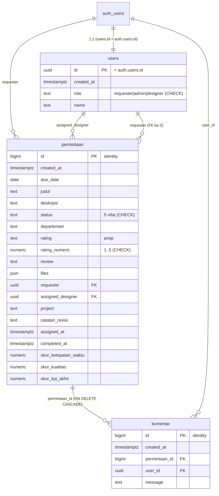

# Dokumentasi Sistem — DesignDesk (Sistem Manajemen Permintaan Desain)

> Referensi teknis lengkap untuk keperluan analisis & penulisan skripsi.
> Mencakup: arsitektur, peran, alur bisnis, **struktur database penuh (DDL, constraint, RLS)**, dan **detail algoritma** (self-assignment anti-race, weighted KPI scoring, trigger).
> Sumber kebenaran: kode aplikasi + migration `supabase/migrations/`. Diperbarui: 2026-06-21.

---

## DAFTAR ISI
1. Gambaran Umum & Tujuan
2. Arsitektur & Tech Stack
3. Aktor (Role) & Hak Akses
4. Alur Bisnis & Siklus Status
5. Struktur Database (ERD, DDL, constraint, RLS)
6. Algoritma & Logika Inti
7. Referensi Fungsi & Trigger Database (source)
8. Arsitektur Frontend (routing, guard, helper)
9. Keamanan & Keterbatasan
10. Panduan Pemetaan ke Skripsi
11. Konfigurasi & Akun Demo

---

## 1. Gambaran Umum & Tujuan

**DesignDesk** adalah sistem informasi manajemen permintaan desain (*design request / internal helpdesk*) untuk divisi Desain Grafis sebuah perusahaan. Karyawan dari berbagai departemen (requester) mengajukan permintaan desain; tim desainer mengerjakannya melalui mekanisme **antrean terbuka dengan pengambilan tugas mandiri (pool-based self-assignment)**; admin mengawasi seluruh proses dan menilai kinerja desainer melalui **KPI otomatis berbasis pembobotan (weighted performance scoring)**.

**Masalah yang diselesaikan:**
- Permintaan desain sebelumnya dikelola manual (chat/email) → tidak terlacak, tidak ada SLA, tidak ada penilaian kinerja objektif.
- DesignDesk menstandarkan alur (pengajuan → pengerjaan → review → revisi → selesai), menyimpan lampiran terpusat, menyediakan diskusi per tiket, dan **menghitung KPI desainer secara otomatis** dari dua komponen terukur: **ketepatan waktu** dan **kepuasan pengguna (rating)**.

**Tujuan KPI:** memberi ukuran kinerja yang adil & objektif per desainer, sehingga admin dapat memonitor performa dan mengidentifikasi tiket bermasalah. Karena itu **admin sengaja dipisah dari eksekusi tiket** — bila admin ikut mengerjakan, data KPI menjadi bias.

---

## 2. Arsitektur & Tech Stack

| Lapisan | Teknologi | Catatan |
|---|---|---|
| Framework | **Next.js 16** (App Router, Turbopack), **React 19** | Server & Client Components |
| Bahasa | TypeScript | strict mode |
| Database & Auth | **Supabase (PostgreSQL 17.6)** | Auth via GoTrue, RLS |
| Storage | Supabase Storage | 2 bucket publik |
| UI | Tailwind CSS v4, Radix UI, komponen gaya shadcn, lucide-react | |
| Tema | next-themes | mode terang/gelap, diganti via halaman Profile |
| State (UI) | Zustand | hanya state ringan (toggle sidebar) |
| Chart | Recharts | tren & statistik dashboard |
| Util | date-fns, **xlsx** (export Excel), **jspdf + jspdf-autotable** (cetak PDF), sonner (toast) | |

**Prinsip arsitektur kunci:**
1. **Logika berat di database** (PL/pgSQL function + trigger), bukan di client. Alasan: aplikasi hanya memakai **anon key** (tidak ada `service_role` di kode), sehingga perhitungan KPI & integritas waktu harus dijamin di level DB agar tidak bisa dimanipulasi/terlewat dari sisi client.
2. **Skor di-snapshot** ke kolom tabel saat tiket selesai; agregasi (rata-rata, laporan) **membaca kolom tersimpan**, tidak menghitung ulang dari nol tiap render.
3. **Akses antar-peran dijaga di sisi client** (guard) karena RLS sengaja longgar pada fase ini (lihat §9).

Pola koneksi Supabase: `lib/supabase/client.ts` (browser), `lib/supabase/server.ts` (server, cookie-based), `lib/supabase/middleware.ts` + `middleware.ts` (refresh sesi). Semua memakai `NEXT_PUBLIC_SUPABASE_URL` + `NEXT_PUBLIC_SUPABASE_PUBLISHABLE_OR_ANON_KEY`.

---

## 3. Aktor (Role) & Hak Akses

`public.users.role ∈ { 'requester', 'admin', 'designer' }` (default `'requester'`, dibatasi CHECK constraint).

| Aktivitas | Requester | Designer | Admin |
|---|:---:|:---:|:---:|
| Buat permintaan desain | ✅ (untuk diri sendiri) | — | ✅ (atas nama user) |
| Lihat antrean tiket terbuka | — | ✅ | — (monitoring) |
| Ambil tugas (self-assignment) | — | ✅ | ❌ |
| Ubah status tiket | ❌ | ✅ (PROGRESS/REVIEW/REVISION) | ❌ |
| Unggah file hasil desain | ❌ | ✅ | ❌ |
| Minta revisi | ✅ | — | ❌ |
| Setujui hasil (→ DONE) + rating | ✅ | — | ❌ |
| Diskusi/komentar per tiket | ✅ | ✅ | ✅ (untuk eskalasi) |
| Monitoring seluruh tiket | — | — | ✅ (read-only) |
| Kelola pengguna & role | — | — | ✅ |
| Lihat Laporan KPI seluruh desainer | — | — | ✅ |
| Lihat KPI pribadi | — | ✅ | — |

**Pemisahan wewenang (separation of duties):** Admin = pengawasan/manajemen; Designer = eksekusi. Ini fondasi keadilan KPI.

---

## 4. Alur Bisnis & Siklus Status

### 4.1 Diagram alur status (`permintaan.status`, tipe `text`, divalidasi CHECK constraint)

```
            (requester buat)              (designer "Ambil Tugas")
   ┌───────────────────────────┐     ┌──────────────────────────────┐
   │                           ▼     │                              ▼
 (mulai) ───────────────────► TO DO ─┴─────────────────────────► PROGRESS
                                                                   │  ▲
                                            (designer unggah hasil,│  │ (designer perbaiki)
                                             set REVIEW)           ▼  │
                                                                REVIEW │
                                              ┌────────────────────┴───┴──────┐
                                 (requester minta revisi)        (requester setuju)
                                              ▼                            ▼
                                          REVISION ──(designer kerjakan)──► ... ──► DONE
                                                                                     │
                                                                          (requester beri rating)
                                                                                     ▼
                                                                          completed_at + skor KPI
```

### 4.2 Definisi status & pemicu

| Status | Arti | Diubah oleh | Efek samping |
|---|---|---|---|
| `TO DO` | Baru diajukan, masih di antrean terbuka (belum ada PIC) | Requester (saat membuat) | — |
| `PROGRESS` | Sedang dikerjakan; `assigned_designer` & `assigned_at` terisi | **Designer** (saat "Ambil Tugas") | trigger isi `assigned_at` |
| `REVIEW` | Hasil sudah diunggah, menunggu penilaian requester | Designer | — |
| `REVISION` | Requester meminta perbaikan | Requester | catatan revisi ditambahkan ke deskripsi + komentar SYSTEM |
| `DONE` | Disetujui requester (final) | Requester (saat "Selesai" + rating) | trigger isi `completed_at` (sekali) → hitung skor KPI |

> Loop revisi terjadi **sebelum** DONE (REVIEW ↔ REVISION). Saat status mencapai DONE, pekerjaan dianggap final. Reopen dari DONE = kasus langka; lihat §6.4 (snapshot permanen).

---

## 5. Struktur Database

### 5.1 Skema
- **`public`** — tabel & logika aplikasi.
- **`auth`** — dikelola Supabase (sumber identitas `auth.users`).
- **`storage`** — bucket & objek file.
- Ekstensi aktif: `pgcrypto`, `uuid-ossp`, `pg_graphql`, `pg_stat_statements`, `supabase_vault`.

### 5.2 Entity Relationship Diagram (Mermaid)



### 5.3 Tabel `public.users` — profil aplikasi (1:1 dengan `auth.users`)

```sql
CREATE TABLE public.users (
  id         uuid PRIMARY KEY REFERENCES auth.users(id),   -- user_id_fkey
  created_at timestamptz NOT NULL DEFAULT now(),
  role       text DEFAULT 'requester',
  name       text
);
ALTER TABLE public.users
  ADD CONSTRAINT users_role_check CHECK (role IN ('requester','admin','designer'));
ALTER TABLE public.users ENABLE ROW LEVEL SECURITY;
-- Policy:
CREATE POLICY "Public" ON public.users USING (true);   -- ALL, longgar (lihat §9)
```

### 5.4 Tabel `public.permintaan` — entitas inti (satu tiket permintaan desain)

```sql
CREATE TABLE public.permintaan (
  id                  bigint GENERATED BY DEFAULT AS IDENTITY PRIMARY KEY,
  created_at          timestamptz NOT NULL DEFAULT now(),
  due_date            date,
  judul               text,
  deskripsi           text,
  status              text,                 -- siklus §4
  departemen          text,
  rating              text,                 -- ARSIP (rating lama, tak dipakai logika baru)
  rating_numeric      numeric,              -- rating 1-5 (sumber skor_kualitas)
  review              text,
  files               json,                 -- [{name, url}] lampiran di Storage
  requester           uuid,                 -- pemohon
  assigned_designer   uuid,                 -- desainer PIC (dulu kolom 'admin')
  project             text,
  catatan_revisi      text,
  assigned_at         timestamptz,          -- waktu tugas diambil
  completed_at        timestamptz,          -- waktu pertama DONE (snapshot)
  skor_ketepatan_waktu numeric,             -- 0..100
  skor_kualitas        numeric,             -- rating_numeric * 20
  skor_kpi_akhir       numeric              -- 0.35*ketepatan + 0.65*kualitas
);

-- Constraint
ALTER TABLE public.permintaan
  ADD CONSTRAINT permintaan_status_check
  CHECK (status IN ('TO DO','PROGRESS','REVIEW','REVISION','DONE'));
ALTER TABLE public.permintaan
  ADD CONSTRAINT rating_numeric_check CHECK (rating_numeric BETWEEN 1 AND 5);

-- Foreign keys
--   komentar_* lihat 5.5
ALTER TABLE public.permintaan ADD CONSTRAINT permintaan_requester_fkey
  FOREIGN KEY (requester) REFERENCES auth.users(id);
ALTER TABLE public.permintaan ADD CONSTRAINT permintaan_requester_fkey1
  FOREIGN KEY (requester) REFERENCES public.users(id);          -- FK ke-2 (redundan, lihat §9)
ALTER TABLE public.permintaan ADD CONSTRAINT permintaan_assigned_designer_fkey
  FOREIGN KEY (assigned_designer) REFERENCES public.users(id);

ALTER TABLE public.permintaan ENABLE ROW LEVEL SECURITY;
CREATE POLICY "public" ON public.permintaan USING (true);       -- ALL, longgar (§9)
```

### 5.5 Tabel `public.komentar` — diskusi per tiket

```sql
CREATE TABLE public.komentar (
  id            bigint GENERATED ALWAYS AS IDENTITY PRIMARY KEY,
  created_at    timestamptz NOT NULL DEFAULT now(),
  permintaan_id bigint NOT NULL REFERENCES public.permintaan(id) ON DELETE CASCADE,
  user_id       uuid   NOT NULL REFERENCES auth.users(id),
  message       text   NOT NULL
);
ALTER TABLE public.komentar ENABLE ROW LEVEL SECURITY;

-- Hanya pihak terkait tiket (requester / assigned_designer) ATAU admin yang boleh akses.
CREATE POLICY "Users can view comments on their requests" ON public.komentar
FOR SELECT USING (
  auth.uid() IN (
    SELECT requester         FROM permintaan WHERE id = komentar.permintaan_id
    UNION
    SELECT assigned_designer FROM permintaan WHERE id = komentar.permintaan_id
  )
  OR EXISTS (SELECT 1 FROM users WHERE id = auth.uid() AND role = 'admin')
);
CREATE POLICY "Users can insert comments on their requests" ON public.komentar
FOR INSERT WITH CHECK ( /* syarat sama seperti SELECT di atas */ );
```

### 5.6 View `public.user_profiles` — gabungan identitas + profil

```sql
CREATE VIEW public.user_profiles AS
SELECT au.id, au.email, au.raw_user_meta_data,
       au.created_at AS auth_created_at,
       u.role, u.name, u.created_at AS user_created_at
FROM auth.users au
LEFT JOIN public.users u ON au.id = u.id;
```
Dipakai luas di frontend untuk menampilkan nama/email (karena `auth.users.email` tidak bisa di-query langsung lewat anon dari `public`).

### 5.7 Storage
Dua bucket **public**: `permintaan` (lampiran dari requester) & `hasil-desain` (file hasil dari desainer). Path objek disimpan pada `permintaan.files` (JSON array `{name, url}`). RLS `storage.objects`: 8 policy (4 per bucket) — `SELECT/INSERT/UPDATE/DELETE` untuk role `public`, difilter `bucket_id`.

---

## 6. Algoritma & Logika Inti

### 6.1 Auto-provisioning profil (`handle_new_user`)
Saat akun baru muncul di `auth.users` (signup), trigger `on_auth_user_created` (AFTER INSERT) memanggil `handle_new_user()` yang menyisipkan baris `public.users` dengan `role='requester'`, `name=NULL`. Ini menjamin setiap akun auth selalu punya profil aplikasi 1:1 tanpa perlu kode client. Promosi ke `designer`/`admin` dilakukan via halaman User Management atau SQL manual.

### 6.2 Self-Assignment Pool-Based + Pencegahan Race Condition

**Masalah:** Antrean tiket `TO DO` bersifat terbuka — banyak desainer melihat daftar yang sama. Bila dua desainer menekan "Ambil Tugas" pada tiket yang sama nyaris bersamaan, tanpa proteksi keduanya bisa merasa berhasil (lost update).

**Solusi — Optimistic concurrency via conditional UPDATE atomik:**
Pengambilan tugas dilakukan dengan satu pernyataan `UPDATE ... WHERE` yang menyertakan **prasyarat status awal**, lalu memeriksa **jumlah baris yang benar-benar terupdate**:

```ts
// app/(With Sidebar)/permintaan-desain-designer/page.tsx  (handleAmbil)
const { data, error } = await supabase
  .from("permintaan")
  .update({
    assigned_designer: userId,
    status: "PROGRESS",
    assigned_at: new Date().toISOString(),
  })
  .eq("id", ticketId)
  .is("assigned_designer", null)   // ← prasyarat: belum ada PIC
  .eq("status", "TO DO")           // ← prasyarat: masih di antrean
  .select("id");                   // kembalikan baris yang benar-benar berubah

if (!error && data?.length === 1) {
  // sukses — desainer ini yang mengunci tiket
} else {
  // 0 baris terupdate → tiket sudah diambil desainer lain
  toast.error("Tiket ini baru saja diambil desainer lain.");
  refetchAntrean();
}
```

**Mengapa aman:** PostgreSQL mengeksekusi tiap `UPDATE` baris secara atomik dengan row-level lock. Desainer pertama mengubah `assigned_designer` dari `NULL` → uuid-nya. Desainer kedua menjalankan UPDATE dengan syarat `assigned_designer IS NULL` yang kini **tidak lagi terpenuhi** → 0 baris terpengaruh → frontend menampilkan notifikasi & refresh. Tidak diperlukan lock eksplisit/transaksi panjang.

Trigger `trg_permintaan_done` juga mengisi `assigned_at` sebagai cadangan bila frontend lupa mengirimnya.

### 6.3 Weighted KPI Scoring (algoritma utama skripsi)

**Dua komponen terukur:**

**(a) Skor Ketepatan Waktu** — fungsi dari selisih hari antara penyelesaian dan tenggat:
```
late_days = completed_at::date - due_date          (integer hari kalender)
skor_ketepatan_waktu =
    100                              , jika late_days <= 0  (tepat/lebih cepat)
    max(0, 100 - 10 * late_days)     , jika late_days  > 0  (telat; −10 poin/hari, floor 0)
```
Penjelasan: setiap hari keterlambatan mengurangi 10 poin; keterlambatan ≥ 10 hari = 0. Bila tiket belum DONE (`completed_at` NULL), skor ini NULL. Bila `due_date` NULL, dianggap on-time (100).

**(b) Skor Kualitas** — linear dari rating bintang 1–5:
```
skor_kualitas = rating_numeric * 20
  → bintang 1=20, 2=40, 3=60, 4=80, 5=100
```
NULL bila requester belum memberi rating.

**(c) Nilai Akhir KPI** — pembobotan (kualitas lebih dominan, 65%):
```
skor_kpi_akhir = 0.35 * skor_ketepatan_waktu + 0.65 * skor_kualitas
```
Hanya dihitung bila **kedua** komponen tersedia; selama rating belum diisi, `skor_kpi_akhir` tetap NULL.

**Contoh perhitungan:**

| Kasus | due_date | completed | late | Ketepatan | rating | Kualitas | KPI Akhir |
|---|---|---|---:|---:|---:|---:|---:|
| Lebih cepat | 20 Jun | 18 Jun | −2 | 100 | 5 | 100 | **100.0** |
| Telat 3 hari | 15 Jun | 18 Jun | 3 | 70 | 4 | 80 | **76.5** |
| Telat 11 hari | 07 Jun | 18 Jun | 11 | 0 (floor) | 3 | 60 | **39.0** |
| Selesai, belum dirating | 20 Jun | 18 Jun | −2 | 100 | — | NULL | **NULL** |

(76.5 = 0.35·70 + 0.65·80 = 24.5 + 52; 39.0 = 0.35·0 + 0.65·60.)

**Kapan dihitung (event-driven via trigger):**
1. `trg_permintaan_done` (**BEFORE UPDATE**): saat status berubah ke `DONE` pertama kali → set `completed_at = now()` (snapshot, tidak menimpa bila sudah ada).
2. `trg_kpi_recalc` (**AFTER UPDATE**, dengan `WHEN (completed_at` berubah `OR rating_numeric` berubah`)`) → panggil `calculate_kpi_score(id)` yang menghitung & menyimpan ketiga skor.

Karena rating biasanya diisi requester **setelah** status DONE, alur normalnya: (1) DONE → `completed_at` & `skor_ketepatan_waktu` terisi, `skor_kpi_akhir` masih NULL; (2) requester memberi rating → `rating_numeric` berubah → trigger menghitung ulang `skor_kualitas` & `skor_kpi_akhir`.

**Pencegahan rekursi trigger:** `calculate_kpi_score` melakukan `UPDATE` pada tabel yang sama (hanya kolom skor). Agar tidak memicu dirinya tanpa henti, trigger `trg_kpi_recalc` memakai klausa `WHEN` yang **hanya** aktif saat `completed_at` atau `rating_numeric` berubah — perubahan kolom `skor_*` tidak memenuhi `WHEN`, sehingga rekursi berhenti.

**Snapshot & reopen:** `completed_at` di-set sekali (saat DONE pertama) dan tidak dihapus bila tiket di-reopen. Ini menjadikan skor sebagai **snapshot permanen** sehingga KPI stabil & adil; loop revisi yang wajar terjadi sebelum DONE sehingga tidak memengaruhi `completed_at`.

### 6.4 Agregasi Dashboard (scoping per role)
`app/(With Sidebar)/dashboard/page.tsx` memfilter data sesuai peran:
- **Admin** → global (tanpa filter).
- **Designer** → `assigned_designer = uid`; kartu "Baru" memakai hitung **antrean terbuka** (`status='TO DO' AND assigned_designer IS NULL`).
- **Requester** → `requester = uid`.

Statistik ringkas diambil dari RPC `get_dashboard_stats()` (lihat §7) yang kini menyajikan `rataRataRating` (dari `rating_numeric`), `rataRataWaktuPengerjaan` (rata-rata hari `completed_at − assigned_at`), dan `rataRataSkorKPI`.

### 6.5 Laporan KPI per Desainer
RPC `get_designer_kpi_report(p_designer, p_start, p_end)` mengagregasi per desainer dalam rentang waktu: jumlah tugas selesai, rata-rata ketepatan/kualitas/KPI, serta daftar **tiket perlu perhatian** (skor `< 60`). Halaman `laporan-kpi` (admin) menampilkannya dengan filter periode + dropdown desainer, dan menyediakan **export Excel** (`xlsx`, 2 sheet) & **cetak PDF** (`jspdf` + `jspdf-autotable`).

---

## 7. Referensi Fungsi & Trigger Database (source)

### 7.1 `handle_new_user()` + trigger `on_auth_user_created`
```sql
CREATE OR REPLACE FUNCTION public.handle_new_user()
RETURNS trigger LANGUAGE plpgsql SECURITY DEFINER SET search_path TO 'public' AS $$
BEGIN
  INSERT INTO public.users (id, role, name) VALUES (NEW.id, 'requester', NULL);
  RETURN NEW;
END; $$;

CREATE TRIGGER on_auth_user_created
  AFTER INSERT ON auth.users FOR EACH ROW EXECUTE FUNCTION public.handle_new_user();
```

### 7.2 `calculate_kpi_score(p_id bigint)`
```sql
CREATE OR REPLACE FUNCTION public.calculate_kpi_score(p_id bigint)
RETURNS void LANGUAGE plpgsql SECURITY DEFINER SET search_path TO 'public' AS $$
DECLARE
  v_due date; v_completed timestamptz; v_rating numeric;
  v_late_days integer; v_ketepatan numeric; v_kualitas numeric; v_akhir numeric;
BEGIN
  SELECT due_date, completed_at, rating_numeric
    INTO v_due, v_completed, v_rating
    FROM public.permintaan WHERE id = p_id;

  IF v_completed IS NULL THEN
    v_ketepatan := NULL;
  ELSIF v_due IS NULL THEN
    v_ketepatan := 100;
  ELSE
    v_late_days := (v_completed::date - v_due);
    IF v_late_days <= 0 THEN v_ketepatan := 100;
    ELSE v_ketepatan := greatest(0, 100 - (10 * v_late_days)); END IF;
  END IF;

  IF v_rating IS NULL THEN v_kualitas := NULL;
  ELSE v_kualitas := v_rating * 20; END IF;

  IF v_ketepatan IS NOT NULL AND v_kualitas IS NOT NULL THEN
    v_akhir := (0.35 * v_ketepatan) + (0.65 * v_kualitas);
  ELSE v_akhir := NULL; END IF;

  UPDATE public.permintaan
     SET skor_ketepatan_waktu = v_ketepatan,
         skor_kualitas        = v_kualitas,
         skor_kpi_akhir       = v_akhir
   WHERE id = p_id;
END; $$;
```

### 7.3 Trigger `trg_permintaan_done` (BEFORE UPDATE) — isi `completed_at` & `assigned_at`
```sql
CREATE OR REPLACE FUNCTION public.handle_permintaan_done()
RETURNS trigger LANGUAGE plpgsql AS $$
BEGIN
  IF NEW.status = 'DONE' AND (OLD.status IS DISTINCT FROM 'DONE')
     AND NEW.completed_at IS NULL THEN
    NEW.completed_at := now();                 -- snapshot pertama
  END IF;
  IF NEW.assigned_designer IS NOT NULL AND OLD.assigned_designer IS NULL
     AND NEW.assigned_at IS NULL THEN
    NEW.assigned_at := now();                  -- fallback waktu assign
  END IF;
  RETURN NEW;
END; $$;

CREATE TRIGGER trg_permintaan_done
  BEFORE UPDATE ON public.permintaan FOR EACH ROW
  EXECUTE FUNCTION public.handle_permintaan_done();
```

### 7.4 Trigger `trg_kpi_recalc` (AFTER UPDATE, anti-rekursi)
```sql
CREATE OR REPLACE FUNCTION public.trg_kpi_recalc()
RETURNS trigger LANGUAGE plpgsql AS $$
BEGIN
  PERFORM public.calculate_kpi_score(NEW.id);
  RETURN NULL;
END; $$;

CREATE TRIGGER trg_kpi_recalc
  AFTER UPDATE ON public.permintaan FOR EACH ROW
  WHEN (NEW.completed_at IS DISTINCT FROM OLD.completed_at
        OR NEW.rating_numeric IS DISTINCT FROM OLD.rating_numeric)
  EXECUTE FUNCTION public.trg_kpi_recalc();
```

### 7.5 `get_dashboard_stats()` → json
```sql
-- field: permintaanBaru(7 hari), sedangDikerjakan(PROGRESS), menungguRevisi(REVISION),
-- selesaiBulanIni(DONE bulan ini), rataRataRating(AVG rating_numeric),
-- rataRataWaktuPengerjaan(AVG hari completed_at-assigned_at utk DONE),
-- rataRataSkorKPI(AVG skor_kpi_akhir).
```

### 7.6 `get_designer_kpi_report(p_designer uuid, p_start date, p_end date)` → json
Mengembalikan json array per desainer (`role='designer'`):
`{ designer_id, designer_name, jumlah_selesai, avg_ketepatan, avg_kualitas, avg_kpi, tiket_perlu_perhatian:[{id,judul,skor_kpi_akhir}] }`.
`p_designer` NULL → semua desainer; `p_start`/`p_end` NULL → tanpa batas periode. Memfilter `status='DONE'` dan `completed_at` dalam rentang. `tiket_perlu_perhatian` = tiket DONE dengan `skor_kpi_akhir < 60`.

### 7.7 `get_daily_request_trend(days_limit int)` → TABLE(request_date text, total bigint)
Jumlah permintaan per hari selama `days_limit` hari terakhir; memakai `generate_series` untuk mengisi tanggal tanpa data dengan 0.

---

## 8. Arsitektur Frontend

### 8.1 Routing (grup layout `app/(With Sidebar)/`)
| Route | Role | Fungsi |
|---|---|---|
| `dashboard` | semua | statistik (scoped per role) + aktivitas terkini |
| `permintaan-desain`, `/buat`, `/[id]` | requester | daftar/ajukan/detail tiket sendiri; aksi revisi/selesai/rating |
| `permintaan-desain-admin`, `/[id]`, `/buat` | admin | monitoring read-only + buat atas nama user |
| `permintaan-desain-designer`, `/tugas-saya`, `/[id]` | designer | antrean+self-assign, tugas saya, eksekusi |
| `riwayat`, `riwayat-pengerjaan` | requester / designer | riwayat + (designer) KPI pribadi |
| `laporan-kpi` | admin | laporan KPI + export Excel/PDF |
| `user-management`, `/[userid]` | admin | kelola pengguna & role |
| `profile` | semua | lihat/ubah nama profil + ganti tema (light/dark) |
| `dokumentasi` | semua | panduan pengguna (penjelasan status & alur) |
| `tentang-app` | semua | halaman "Tentang Aplikasi" |
| `feedback` | semua | halaman umpan balik (placeholder) |

> **Catatan navigasi:** menu utama sidebar bersifat dinamis per-role (`getNavItemsByRole`), sedangkan **Dokumentasi** & **Tentang App** adalah item umum yang selalu tampil untuk semua role. **Profile** diakses dari menu user di footer sidebar.

### 8.2 Helper role terpusat — `lib/auth/roles.ts`
`ROLES`, `normalizeRole`, `isRequester/isAdmin/isDesigner`, `canExecuteTickets`, `canMonitorAll`. Semua pengecekan role memakai helper ini (hindari literal string).

### 8.3 Guard akses — `hooks/use-role-guard.ts`
`useRoleGuard(allow: Role[])`: mengambil user + role, redirect ke `/dashboard` bila role tidak berwenang. Dipakai di setiap halaman spesifik-role. (Lapisan pembatas utama karena RLS longgar.)

### 8.4 Komponen reusable
`components/status-badge.tsx` (warna status konsisten 5 nilai), `components/kpi-scores.tsx` (kartu skor KPI read-only), `components/app-sidebar.tsx` (`getNavItemsByRole` → menu dinamis per role).

---

## 9. Keamanan & Keterbatasan (penting untuk bab Pengujian/Saran)

1. **RLS longgar by design (fase ini):** `users` & `permintaan` memakai policy `USING (true)` → siapa pun dengan anon key dapat membaca/menulis baris. Pembatasan akses antar-peran **saat ini bergantung pada guard client-side**. Hanya `komentar` yang RLS-nya berbasis kepemilikan. **Pengetatan RLS adalah pekerjaan lanjutan (belum dilakukan)** — kandidat utama "Saran Pengembangan" di skripsi.
2. **Anon key only:** tidak ada `service_role` di kode → integritas KPI dijamin di DB (trigger), bukan client.
3. **`requester` punya dua FK** (`→auth.users` & `→users`) — redundan, bisa disederhanakan.
4. **Kolom `rating` (text) lama** dipertahankan sebagai arsip; logika baru memakai `rating_numeric` (numeric, CHECK 1..5).
5. Validasi `status` & `rating_numeric` kini diperkuat CHECK constraint (sebelumnya text bebas).

---

## 10. Panduan Pemetaan ke Skripsi

Saran pemetaan materi dokumen ini ke struktur skripsi sistem informasi umum:

- **BAB I Pendahuluan** — §1 (latar belakang masalah pengelolaan manual, tujuan KPI objektif, rumusan masalah pemisahan peran).
- **BAB II Landasan Teori** — Next.js/React, PostgreSQL/Supabase, konsep RLS, *trigger/stored procedure*, *weighted scoring*, *optimistic concurrency control*.
- **BAB III Analisis & Perancangan** —
  - Analisis aktor & kebutuhan: §3 (tabel hak akses → dasar *use case diagram*).
  - Perancangan proses: §4 (siklus status → *activity/state diagram*), §6.2 & §6.3 (algoritma → *flowchart*).
  - Perancangan basis data: §5 (ERD §5.2, DDL, normalisasi, constraint).
- **BAB IV Implementasi & Pengujian** —
  - Implementasi: §7 (source function/trigger), §8 (frontend), §6.5 (laporan + export).
  - Pengujian: §6.3 (tabel contoh perhitungan KPI = *test case*; nilai harapan vs hasil), pengujian self-assignment race (§6.2), pengujian black-box per peran (§3).
- **BAB V Penutup** — §9 (keterbatasan RLS, FK redundan → *saran pengembangan*).

**Metode KPI** yang dipakai dapat dideskripsikan sebagai *Weighted Sum Model / Simple Additive Weighting (SAW)* sederhana dengan dua kriteria (ketepatan waktu bobot 0.35, kualitas bobot 0.65) dan normalisasi skor ke skala 0–100.

---

## 11. Konfigurasi & Akun Demo

`.env` (gitignored):
```
NEXT_PUBLIC_SUPABASE_URL=<url-project-supabase>
NEXT_PUBLIC_SUPABASE_PUBLISHABLE_OR_ANON_KEY=<anon-key>
```

Migrations: `supabase/migrations/` — `..._role-separation.sql` (3 role + rename kolom + policy) dan `..._kpi-scoring.sql` (kolom skor + function + trigger + RPC).

Akun demo (DB skripsi), password `demo1234`:
`requester@demo.com` (requester) · `designer@demo.com` (designer) · `admin@demo.com` (admin).

Promosi role manual: `UPDATE public.users SET role='designer'|'admin' WHERE id='<uuid>';`
